<style>

section {
  background-color: #fefefe;
  color: #333;
}

img[alt~="center"] {
  display: block;
  margin: 0 auto;
}
blockquote {
  background: #ffedcc;
  border-left: 10px solid #d1bf9d;
  margin: 1.5em 10px;
  padding: 0.5em 10px;
}
blockquote:before{
  content: unset;
}
blockquote:after{
  content: unset;
}
</style>

<!-- _class: lead -->


# Ciel ! Mon Kubernetes mine des 
#  Bitcoins 

---

## ~# whoami

Denis GERMAIN

Ingénieur Cloud chez 

Auteur principal sur [blog.zwindler.fr](https://blog.zwindler.fr)*

 @zwindler / @zwindler_rflx

**#geek** **#SF** **#courseAPied**


<br/>

**Les slides de ce talk sont sur le blog*

---

## 

Leader mondial des solutions technologiques intégrées pour les entreprises utilisatrices de cuir ou textile


---

## Que fait un ingénieur cloud chez  ?

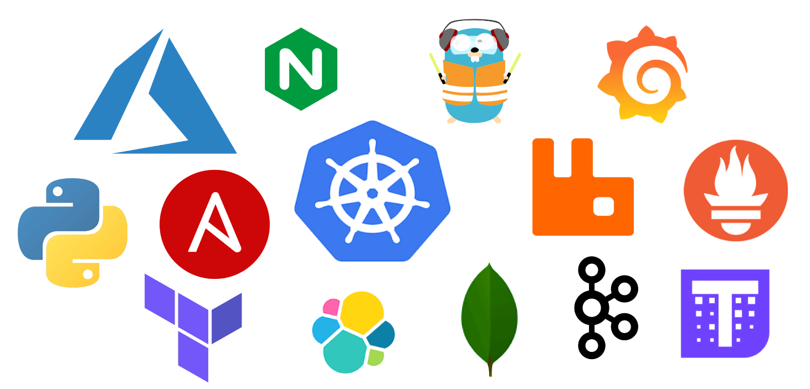

---

## D’ailleurs… je cherche des collègues !

* Un·e OPS pour créer des clusters dans le cloud 👩‍💻 👨‍💻

* Et des Devs pour les ~~casser~~ faire scaler 🤣

* Et plus encore

* GOTO ➔ https://www.lectra.com/fr/carrieres/europe

---

<!-- _class: lead -->

# Ciel ! Mon Kubernetes mine des 
#  Bitcoins 

---

## Mais... c'est quoi Kubernetes / Docker déjà ?

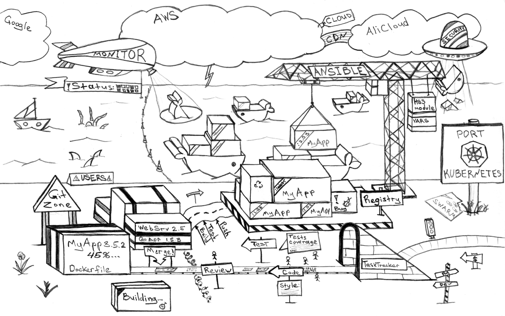
Crédits : [Dmitriy Paunin](https://habr.com/en/post/321810/)

---

## Les containers Docker

Technologie de containerisation d'applications

* sortie en 2013
* utilise des fonctionnalités du kernel Linux
* gestion via une interface "simple"
* fourni un magasin d'images librement accessibles


---

## Docker et ses promesses

* Rend l'infra *facile* pour le Dev
* Economies hardware (par rapport aux VMs)
* Sécurité (isolation des applications)
* Immutabilité (déploiements et mises à jours reproductibles) 

---

## Retour à la réalité

**Techniquement** : on a réinventé les `jail` avec une interface de management "simple" et des images préconfigurées

Mais on ne sait toujours pas comment gérer :

* la haute disponibilité ?
* la tolérance de panne ?
* les droits d'accès ?

---

## Kubernetes

* Orchestrateur de containers, inspiré par un outil interne de Google

* Donné à la CNCF (spin-off Linux Foundation)

* Open Sourcé en 2015

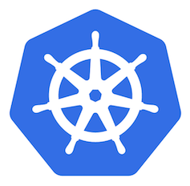

---

## C'est un outil puissant et complexe

> Kubernetes définit un **certain** nombre d'objets qui, ensemble, fournissent des mécanismes pour déployer, maintenir et mettre à l’échelle des applications

* *Pod, Deployment, ReplicaSet, DaemonSet, StatefulSet* pour l'appli
* *Role, RoleBinding, ClusterRoleBinding, ServiceAccount* pour la gestion des droits
* ...

---

## Par extension, c'est un outil verbeux

Lancer nginx dans **Docker**
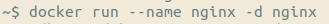
Versus dans **Kubernetes**
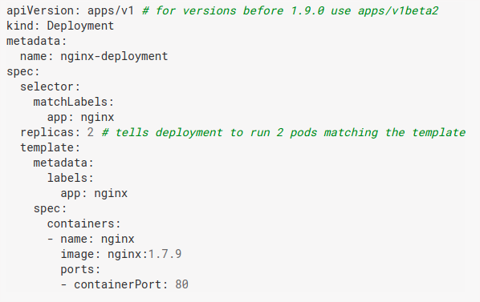

---

<!-- _class: lead -->

# What could possibly go wrong ?

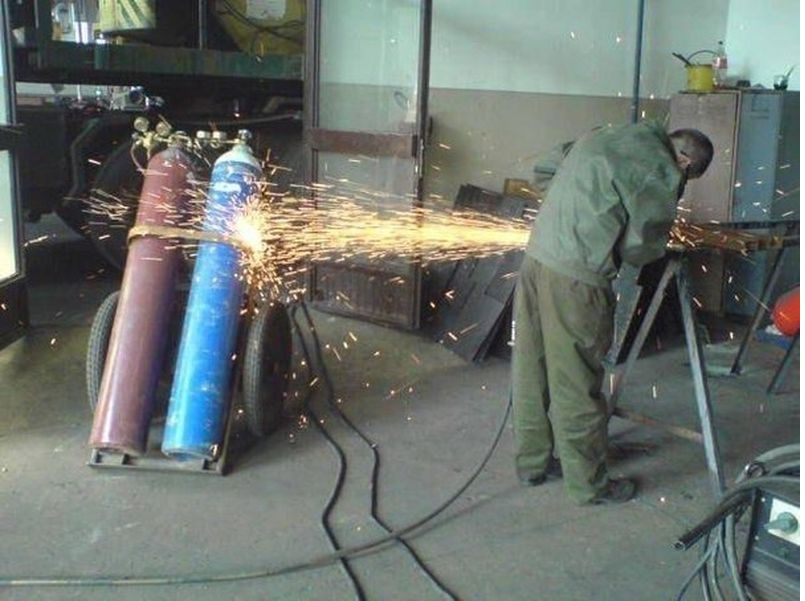

---

## Un outil complexe ? Pas grave, il y a une UI !

L'histoire récente regorge de failles et d'exploits sur des interfaces de management ouvertes sur Internet

* **phpMyAdmin**

* **tomcat-manager**

* **webmin**

* ...

---

## Et pourtant... Tesla ...

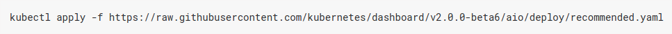

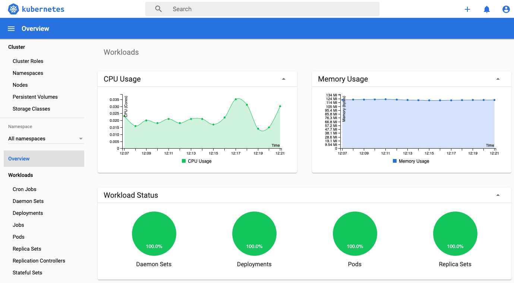

---

## “Not password protected”

> The hackers had infiltrated Tesla’s Kubernetes console which was **not password protected** / [Source : redlock.io](https://redlock.io/blog/cryptojacking-tesla)

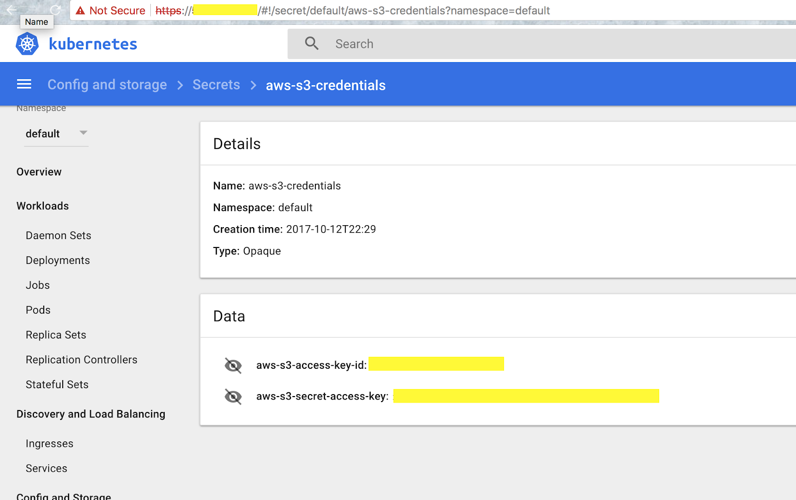

---

## Game over

<br/>


---

## Moralité : n'exposez pas la console

Vraiment.

**N'exposez pas la console. Ne la déployez même pas.**

* Vue incomplète de votre cluster et de votre métrologie
* Préférez lui `kubectl`, **Grafana**, **Prometheus** ou des outils de supervision tiers
* Les clouds providers la désactivent par défaut

---

## Contrôle d'accès dans Kubernetes

* Depuis la 1.6 (2017), RBAC (Role-based access control) par défaut
  * Donner des droits fins
    * par type de ressource 
    * par type d'accès
  * De les affecter à des groupes d'utilisateurs ou d'applications

* Appliquez le **principe de moindre privilège**

---

## Le RBAC par l'exemple

&nbsp;&nbsp;&nbsp; 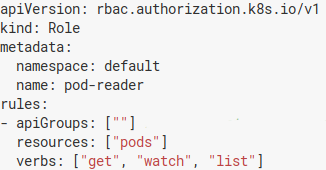 &nbsp; 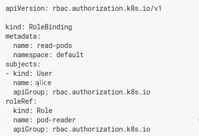

Ex. **alice** a le droit de lister les containers dans le namespace **default**, mais pas de les supprimer ni les créer.

---

## En cas de compromission

Si un compte utilisateur/application est compromis, les accès de l'attaquant seront limités à un périmètre donné :

* **Namespace** (subdivision logique du cluster)
* types d'actions précis pour chaque type de ressources

---

## Dans la pratique

Le **principe des moindres privilèges** est un vrai chantier

* à mettre en place dès le début du cycle de développement
* plus difficile à appliquer *a posteriori* (sauf à tout bloquer)

Pour auditer le RBAC :

* `kubectl auth can-i`
* `kubectl who-can`
* [et plein d'autres](https://twitter.com/learnk8s/status/1190859981811277824?s=19)

---

<!-- _class: lead -->

# “C’est toujours la faute du réseau”

---

## Architecture simplifiée de Kubernetes

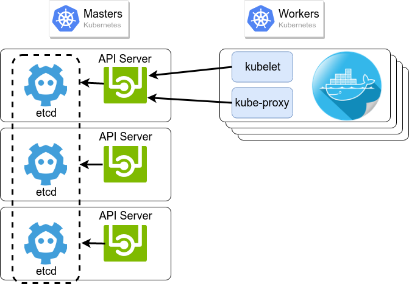

---

## Du TLS partout

Tous les flux doivent être chiffrés, *en particulier ceux de Kubernetes* lui-même (api-server, etcd, ...)

**Point Captain Obvious** : Si les flux ont été chiffrés, il sera plus difficile de récupérer des identifiants

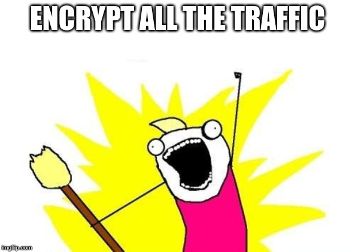

---

## Des APIs fermées

> A quick Shodan search shows that show that more than 2,000 Docker engines are insecurely exposed to the Internet
> -- [unit42 : Graboid](https://unit42.paloaltonetworks.com/graboid-first-ever-cryptojacking-worm-found-in-images-on-docker-hub/)

Pas d'API ouvertes sur Internet !

* Docker API
* Kubernetes API server
* **etcd**

---

## Ajouter des Network Policies

Par défaut, la gestion du réseau virtuel dans Kubernetes *autorise tout container à se connecter à n'importe quel autre*.

&nbsp;&nbsp;&nbsp;&nbsp;&nbsp;&nbsp;&nbsp;&nbsp;&nbsp; 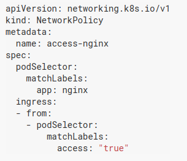 &nbsp;&nbsp;&nbsp;&nbsp; 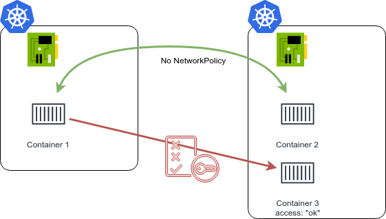

---

## Les bons élèves

**Monzo Bank** a mis en place des [Network Policies pour la totalité de ses 1500 microservices](https://monzo.com/blog/we-built-network-isolation-for-1-500-services) : 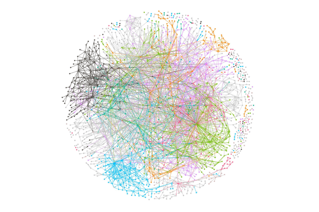

---

## Service Mesh !

Mettre en place des **Network Policies** peut être complexe... 

... mais on peut faire encore plus complexe !

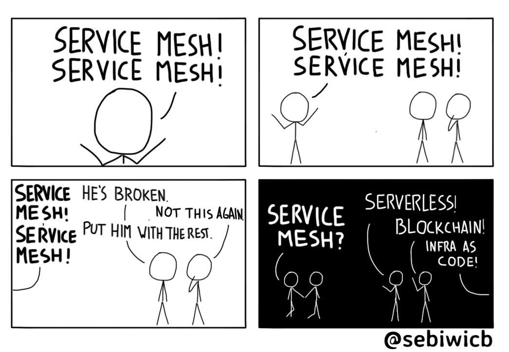

---

<!-- _class: lead -->

# Sécuriser les containers

---

## It's secure

**Sysadmins/Devs:** "It's secure because it's in a container"

**Hackers:**  [@sylvielorxu](https://twitter.com/sylvielorxu/status/1152511215941369856)

---

## Pas de container exécuté en tant que Root !

Kubernetes utilise (pour l'instant) la table des users ID de l'hôte

Si le binaire contenu dans l'image Docker est lancé en tant que **root** (souvent le cas), un attaquant a plus de chance de sortir du container.

[Kubecon EU 2018: The route to Rootless Containers](https://www.youtube.com/watch?v=j4GO2d3YjmE)


---

## Pod Security Policy

Kubernetes permet l'ajout de politiques de conformités, notamment dans le but d'imposer des règles pour les Pods

```YAML
# Required to prevent escalations to root.
allowPrivilegeEscalation: false
runAsUser:
  # Require the container to run without root privileges.
  rule: 'MustRunAsNonRoot'
```

---

## Réduire la surface d'attaque

Limiter l'impact d'une compromission :

* Le moins de dépendances possibles
* Ne pas ajouter des binaires utiles aux attaquants
  * oubliez `ping`, `traceroute`, `gcc`, ...
* Multistage build (images build vs images run)

---

## Scan statique des images

Des CVE sortent sur **NodeJS**, **.Net** et autre **JVM** toutes les semaines

Les images de bases de vos containers sont bourrées de failles

* analyse statiques des images Docker
 

---

## Concrètement

Interface affichant les failles détectées sur chaque image

Rajouter des **quality gates** côté *Intégration Continue* pour bloquer les images qui ne répondent pas aux exigences de sécurité

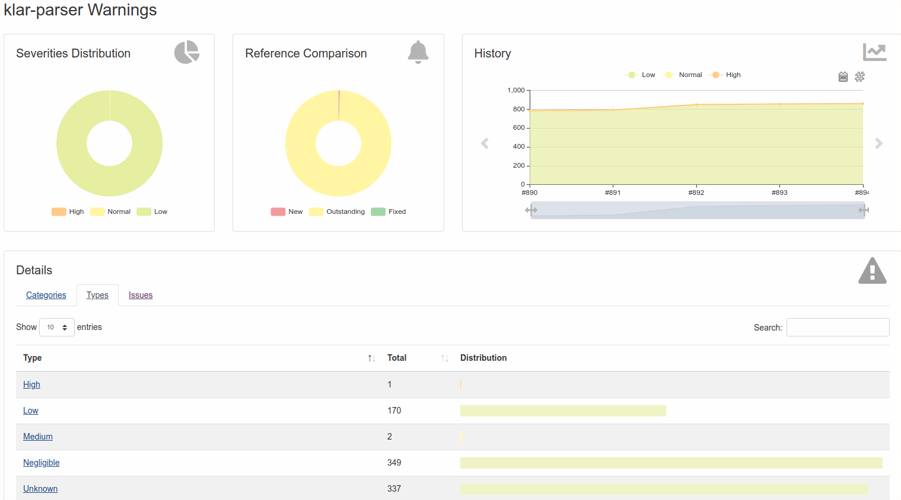

---

## Scan temps réel

Il existe aussi des *Intrusion Detection System* pour Kubernetes


> Falco is an open source project for intrusion and abnormality detection for Cloud Native platforms

---

## “Pourquoi *GCC* tourne sur mon container ?”

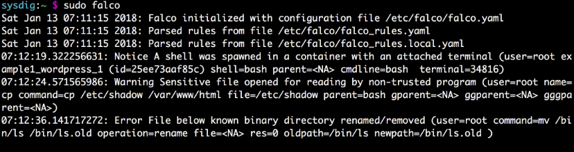

<br/>

[JW Player : How A Cryptocurrency Miner Made Its Way onto Our Internal Kubernetes Clusters](https://medium.com/jw-player-engineering/how-a-cryptocurrency-miner-made-its-way-onto-our-internal-kubernetes-clusters-9b09c4704205)

---

<!-- _class: lead -->

# Et l'infra dans tout ça ?

---

## Kubernetes Security Audit

Comme tout logiciel, Kubernetes a des failles !

Début aout, la CNCF a commandé un audit du code de Kubernetes

* Commencé sur un périmètre restreint
* A permis de déceler 37 vulnérabilités
* Généralisé à tous les nouveaux composants entrant dans la CNCF

---

## D'autres failles dans Kubernetes

Deux autres grosses CVE sont sorties récemment

* 2018 / faille dans l'API server
  * [ZDnet : La première grosse faille de sécurité est là (API server)](https://www.zdnet.fr/actualites/kubernetes-la-premiere-grosse-faille-est-la-39877607.htm)
* 2019 / faille dans RunC pour sortir du container
  * [Faille dans RunC (Docker, Kubernetes et Mesos concernés)](https://www.lemondeinformatique.fr/actualites/lire-une-faille-dans-runc-rend-vulnerable-docker-et-kubernetes-74312.html)

---

## Moralité : mettez à jour régulièrement !


... en vrai, c'est pas forcément simple

[Kubecon EU 2018 - Zalando Continuously Deliver your K8s Infra](https://static.sched.com/hosted_files/kccnceu18/18/2018-05-02%20Continuously%20Deliver%20your%20Kubernetes%20Infrastructure%20-%20KubeCon%202018%20Copenhagen.pdf)

--- 

<!-- _class: lead -->

# “Promis, demain, je sécurise”


---

## There is a lot to Secure

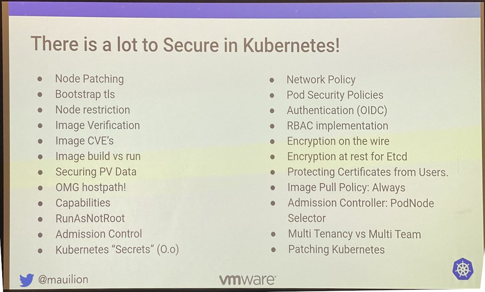

---

## Conclusion

* Ne déployez pas Kubernetes si vous n'en avez pas besoin !
  * Mais si vous pouvez le faire, faites le !
  * [blog : combien de problèmes ces stacks ont générés ?](https://blog.zwindler.fr/2019/09/03/concerning-kubernetes-combien-de-problemes-ces-stacks-ont-generes/)

* Il y a beaucoup de choses à sécuriser dans Kube

* Formez vos Dev, pas seulement les Ops !

* Sécurisez dès le début

---

## That's all folks


---

## Des questions ?


---

# Backup slides

<!-- _class: lead -->

---

## La mode des containers

> **Outil** qui permet d'empaqueter une application et ses dépendances. Elle pourra être exécuté sur n'importe quel serveur

* Il existe de nombreuses implémentations des containers
*  est très utilisé depuis quelques années 
  * utilise des fonctionnalités du kernel Linux
  * fourni une interface "simple" et un magasin d'images

---

## Le container, ce n'est pas une machine virtuelle !

<br/>


---

## Pourquoi utiliser les containers Docker ?

Pratique si on déploie souvent de "petites" applications, en cycle (très) courts

L'application devient immuable

* Si on veut l'upgrader ou changer sa configuration :
  * on ne modifie pas le container (source d'erreur)
  * on déploie la nouvelle version et on supprime l'ancienne

<br/>

[blog.zwindler.fr / Should we have containers ?](https://blog.zwindler.fr/2016/08/25/when-should-we-have-containers/)

---

## Dans un monde parfait (et simpliste)

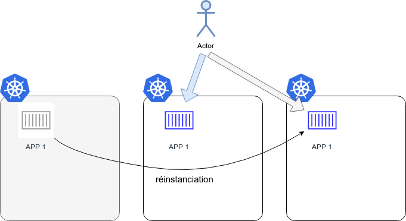

---

## Avec un cluster k8s stateful multizone ?

Zalando a des clusters avec des données... qui ne veulent pas migrer !

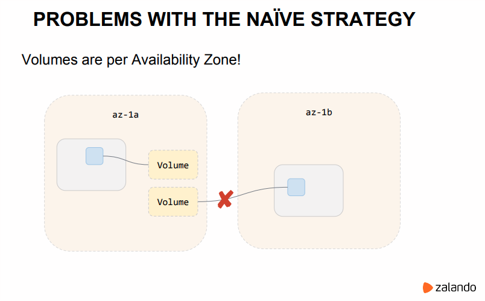

---

<!-- _class: lead -->

# Sources

---

## Les best practices

* [Kubernetes.io : 11 ways not to get hacked](https://kubernetes.io/blog/2018/07/18/11-ways-not-to-get-hacked/)
* [CNCF : Kubernetes security best practices](https://www.cncf.io/blog/2019/01/14/9-kubernetes-security-best-practices-everyone-must-follow/)
* [Rancher : More Kubernetes best practices](https://rancher.com/blog/2019/2019-01-17-101-more-kubernetes-security-best-practices/)
* [Stackrox](https://www.stackrox.com/post/2019/07/kubernetes-security-101/?utm_sq=g6zvjgb9og#final-thoughts-ensure-you-can-answer-these-12-questions-about-your-container-and-kubernetes-environment)
* [Jerry Jalava : Kubernetes Security Journey](https://fr.slideshare.net/jerryjalava/kubernetes-security-journey)
* [Workshop Sécuriser son Kubernetes au DevFest Nantes 2019](https://drive.google.com/file/d/1L5y3s8bq3yIH22S-AQnZIV9DSDFLSzKL/view)

---

## Les outils pour durcir Kube

* [Check des best practices : Kubehunter](https://github.com/aquasecurity/kube-hunter)
* [OnePolicyAgent](https://blog.octo.com/durcissez-votre-kube-avec-openpolicyagent/)
* [Analyse statique : Clair](https://coreos.com/clair/docs/latest/)
* [Analyse statique :Anchore](https://anchore.com/)
* [IDS : Falco](https://falco.org/)
* [SELinux, Seccomp, Falco, a technical discussion](https://sysdig.com/blog/selinux-seccomp-falco-technical-discussion/)

---

## Les failles de sécu récentes de K8s (&+)

* [Faille dans RunC (Docker, Kubernetes et Mesos concernés)](https://www.lemondeinformatique.fr/actualites/lire-une-faille-dans-runc-rend-vulnerable-docker-et-kubernetes-74312.html)
* [Liste des CVE Kubernetes](https://www.cvedetails.com/vulnerability-list/vendor_id-15867/Kubernetes.html)
* [ZDnet : La première grosse faille de sécurité est là (API server)](https://www.zdnet.fr/actualites/kubernetes-la-premiere-grosse-faille-est-la-39877607.htm)
* [L'exploit pour la faille dans l'API Server](https://www.twistlock.com/labs-blog/demystifying-kubernetes-cve-2018-1002105-dead-simple-exploit/)

---

## Les sociétés hackées dans la presse

* [2018 : Cryptojacking chez Tesla](https://redlock.io/blog/cryptojacking-tesla)
* [2019 : Cryptojacking chez jwplayer](https://medium.com/jw-player-engineering/how-a-cryptocurrency-miner-made-its-way-onto-our-internal-kubernetes-clusters-9b09c4704205)
* [Plus d'infos sur le cryptominer XMrig](https://news.sophos.com/fr-fr/2019/05/31/eternel-retour-cryptomineur-xmrig/)
* [ZDNET : des hackers utilisent les API de management de Docker exposées sur le net](https://www.zdnet.com/article/a-hacking-group-is-hijacking-docker-systems-with-exposed-api-endpoints/)

---

## Kubernetes Security Audit 

### Audit du code en aout 2019

* [L'article principal](https://www.cncf.io/blog/2019/08/06/open-sourcing-the-kubernetes-security-audit/)
* [L'audit en lui même](https://github.com/kubernetes/community/blob/master/wg-security-audit/findings/Kubernetes%20Final%20Report.pdf)

---

## Autre

* [Outil d'audit des rôles](https://github.com/Ladicle/kubectl-bindrole?utm_sq=g502s0hv29)
* [Une liste d'outils permettant d'auditer le RBAC dans Kubernetes](https://twitter.com/learnk8s/status/1190859981811277824?s=19)
* [Une image XMRig (Monero) sur le Dockerhub](https://unit42.paloaltonetworks.com/graboid-first-ever-cryptojacking-worm-found-in-images-on-docker-hub/)
* [Twitter : "There is a lot to Secure in Kubernetes"](https://twitter.com/popsysdig/status/1185263894916411404?s=19)
* [DNS Spoofing on Kubernetes Clusters](https://blog.aquasec.com/dns-spoofing-kubernetes-clusters?utm_sq=g7xa5xquzi)
* [Docker and Kubernetes Reverse shells](https://raesene.github.io/blog/2019/08/09/docker-reverse-shells/)
* [Exploiter un Tomcat Manager non sécurisé](https://www.hackingarticles.in/multiple-ways-to-exploit-tomcat-manager/)
* [Backdoor dans webmin](https://pentest.com.tr/exploits/DEFCON-Webmin-1920-Unauthenticated-Remote-Command-Execution.html)