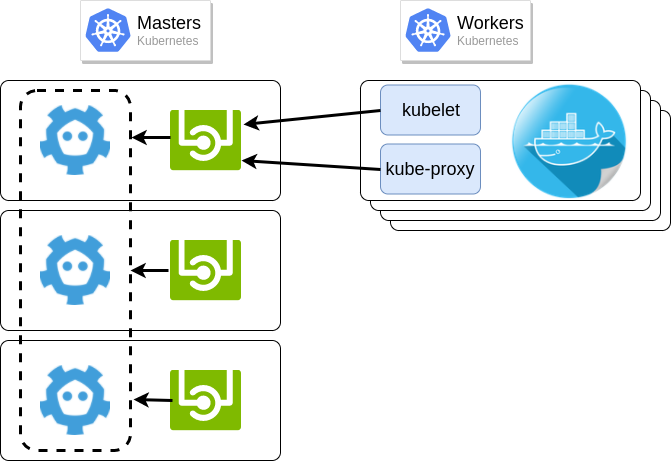

<style>
img[alt~="center"] {
  display: block;
  margin: 0 auto;
}
</style>

<!-- _class: lead -->

# Ciel, mon Kubernetes mine des Bitcoins

---

## ~# whoami

<br/>

Denis GERMAIN

Ingénieur Cloud chez 

Auteur principal sur [blog.zwindler.fr](https://blog.zwindler.fr)

**#geek** **#SF** **#courseAPied**


---

## Lectra

Leader mondial des solutions technologiques intégrées pour les entreprises utilisatrices de cuir ou textile


---

## Que fait un ingénieur cloud chez Lectra ?


---

## Que fait un ingénieur cloud chez Lectra ?

Nuage de logos

---

<!-- _class: lead -->

# Ciel, mon Kubernetes mine des bitcoins !

---

## Mais... c'est quoi Kubernetes déjà ?


Crédits : [Dmitriy Paunin](https://habr.com/en/post/321810/)

---

## La mode des containers

> Un **outil** qui permet d'empaqueter une application et ses dépendances et qui pourra être exécuté sur n'importe quel serveur

* Il existe de nombreuses implémentations des containers
*  est très utilisé depuis quelques années 
  * utilise des fonctionnalités du kernel Linux
  * fourni une interface "simple" et un magasin d'images

---

## Un container n'est pas une machine virtuelle

<br/>


---

## Pourquoi Docker ?

Pratique si on déploie de "petites" applications, souvent, en cycle court (jusqu'à plusieurs fois par jour)

L'application devient immuable

* Si on veut l'upgrader ou changer sa configuration :
  * on ne modifie pas le container (source d'erreur)
  * on déploie la nouvelle version et on supprime l'ancienne

<br/>

[blog.zwindler.fr / Should we have containers ?](https://blog.zwindler.fr/2016/08/25/when-should-we-have-containers/)

---

## Gains apportés par Docker

* applications mutualisées sur un même hardware
* isolées les unes des autres (processus/FS/réseau/RAM)
* des déploiements et mises à jours reproductibles entre serveurs
  * et donc entre environnements (dev, test, prod)

---

## Limites de Docker

**Techniquement** : on a réinventé les jails avec une interface de management "simple"

```Sur mon poste, ça marche.```

Mais comment gérer :

* la haute disponibilité ?
* la tolérance de panne ?
* les droits d'accès ?

---

## Kubernetes

* "Orchestrateur" de containers

* Inspiré par un outil interne de Google

* Donné à la CNCF (spin-off Linux Foundation)

* Open Sourcé en 2015


---

## Un outil complexe... et verbeux
<br/>


Crédits: [Jake Likes Onions](https://jakelikesonions.com/)

---

## Un outil complexe... et verbeux

Lancer nginx dans Docker 

Lancer nginx dans Kubernetes 


---

<!-- _class: lead -->

# "What could go wrong ?"

---

## Un outil complexe ? Pas grave, il y a une UI !

Tesla

---

## Ne pas exposer la console

N'exposez pas la console.

* vue incomplète de votre cluster et de votre métrologie
* lui préférer **kubectl**, **Grafana**, **Prometheus** et des outils de supervision tiers

Les clouds providers la désactive

---

## Mettre du RBAC

---

## TLS everywhere

---

## Mettre des Network policies

By default, Kubernetes networking allows all pod to pod traffic; this can be restricted using a Network Policy

Tout le monde discute avec tout le monde. Un attaquant qui prend la main sur un container peut, s'il a suffisament d'outils, scanner tout le réseau

Si on a mis du TLS partout, plus complexe. Mais ce n'et pas suffisant

Schema

Bon exemple : Monzo bank

---

## Sécurité dans les applications ?

Sysadmins/Devs: "It's secure because it's in a container"

Hackers: 

[@sylvielorxu](https://twitter.com/sylvielorxu/status/1152511215941369856)

---

## Pas de container Root !


Par défaut
This means that a container's user ID table maps to the host's user table, and running a process as the root user inside a container runs it as root on the host. Although we have layered security mechanisms to prevent container breakouts, running as root inside the container is still not recommended.

Many container images use the root user to run PID 1 - if that process is compromised, the attacker has root in the container, and any mis-configurations become much easier to exploit.

Ca peut poser des problèmes pour certaines images Docker => talk sur tous les workaround pour se passer de containers Root https://www.youtube.com/watch?v=j4GO2d3YjmE

---

## Pod Security Policy

Kubernetes permet l'ajout de politiques de conformités, notamment dans le but d'imposer des règles pour les Pods

```YAML
# Required to prevent escalations to root.
allowPrivilegeEscalation: false
runAsUser:
  # Require the container to run without root privileges.
  rule: 'MustRunAsNonRoot'
```

---

## Scan d'images

Clair / Anchore

---

## Scan temps réel

IDS

Falco

---

## Les failles dans Kubernetes

CVE

---

## Kubernetes Security Audit

Début aout, la CNCF a sorti un kit permettant d'auditer les clusters Kubernetes et les composants gravitant autour (CoreDNS, Envoy et Prometheus lors du PoC, mais ouverts à tous les autres projets maintenant).

---

## Mettez à jour régulièrement

Pas forcément simple

Zalando (mise à jour)

---

## Conclusion

* Ne faites pas du Kubernetes si vous n'en avez pas besoin !

* La sécurité, ce n'est ni des outils, ni uniquement l'affaire des Ops. C'est une démarche globale dans l'entreprise.

* Avec suffisament de moyen, vous serez attaqués.

---

## That's all folks


---

## Questions ?


---

# Backup slides

---

## Architecture simplifiée de Kubernetes



---